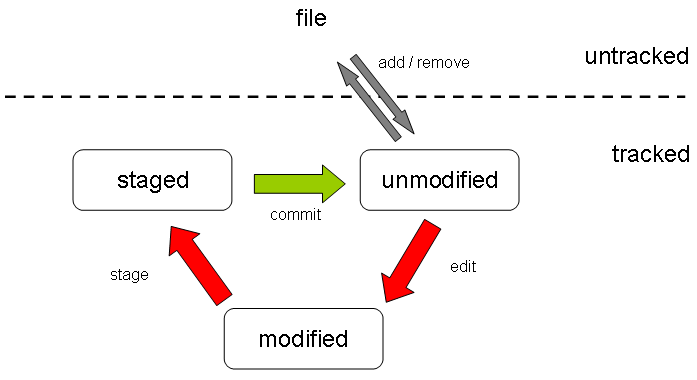
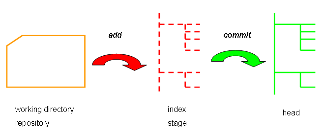

# LCA of a GIT file

****



figure freely inspired by: *"Pro Git"*  by Scott Chacon

*****

# workflow scheme



local repository consists of 3 strucrtures ("trees") maintained through and managed by git 

1. the **working directory** holding the files
2. the **index** playing as a stage area 
3. the **head** pointing to the last commit made

figure re-drawn upon the originals taken from http://rogerdudler.github.io/git-guide/ 

*****

## configure user info for all local repositories

set name to be attached to commit transactions
```
git config --global user.name "my_name"
```

set email to be attached to commit transactions
```
git config --global user.email "my_email"
```

## initialize a new repository

create a new local repository and then...
```
git init
```
this creates a new git repository

or create a new local repository and then...
```
git init project_name
```
this creates a new git repository with a given name

this command creates a new sub-directory named *.git* inside the existing working directory

remember that at this point nothing in the project is tracked yet

## clone a remote existing repository

downloads a project and its entire version history

```
git clone git://github.com/some_owner/some_repository.git
```

this command does the following:

- creates a directory named *some_repository*
- initializes a *.git* directory inside it
- pulls down all the data from the existing repository
- checks out a working copy of latest version

what follows is a variation upon the previous command:

```
git clone git://github.com/some_owner/some_repository.git my_repository
```
it does the same things as before **but**  the target directory is now *my_repository*


## clone a local existing repository

```
git clone path/to/local/repository
```
it creates a copy of a local repository

## check status of files

lists new or edited files to be committed

it is always a good practice to check the status of the files inside the repository: this is simply done by issuing the following command:

```
git status
```
the returned messages give some feedback on what is next needed

## track (add) a new file

snapshot the new file for next versioning (commit)
```
git add a_new_filename
```
changes were add to the **index**

## stage (add) a modified file

snapshot the edited file for next history versioning (i.e. commit)
```
git add a_modified_filename
```
## stage multiple files

some *"almost"*  equivalent forms of the same *add* command dealing with multiple files

```
git add -A     
```
stages all, i.e. a handy shortcut for doing both following staging

```
git add .
```
stages new and modified, without deleted

```
git add -u
```
stages modified and deleted, without new

for further reference see: http://stackoverflow.com/questions/572549/difference-between-git-add-a-and-git-add

## commit the changes

record file snapshot permanently in version history
```
git commit -m "here specify a short message about changes"
```

the *commit* records the snapshot set up in the staging process
file were committed to the **head* but not in your remote repository yet

## (straight) commit the changes without passing through staging

it's not necessary to *git add* before the commit
```
git commit -a -m "here specify a short message about this commit"
```

## add a remote repository from command line

define a remote repository (namely: origin) at a specified url
```
git remote add origin git://github.com/some_owner/some_repository.git
```

## push from local to remote

changes in the **head** of the local working copy are sent to the remote repository (upload local commit to remote repository)

```
git push -u origin master
```
or just more simply
```
git push
```

## check remote repository

verify the name and address of remote repository
```
git remote -v
```

## relocate and remove tracked files

delete the file from the working directory and stage the deletion

```
git rm file_name
```

delete the file from version control but preserve the file locally

```
git rm --cached file_name
```

change the file name and prepare for commit

```
git mv old_file_name new_file_name
```

## pull from remote to local

update local repository to the newest commit in the working directory to fetch and merge remote changes

```
git pull
```
******

## workflow example 1
new repository: initialize, add and commit files, add origin, push to remote

```
echo "#my_title" >> README.md
git init
git add README.md
git commit -m "first commit"
git remote add origin git://github.com/some_owner/some_repository.git
git push -u origin master

```
******

## workflow example 2
clone repository: add and commit files, push back to remote

```
git clone git://github.com/some_owner/some_repository.git
echo "#new_file" >> new_file.md
git add new_file.md
git commit -m "add new_file.md"
git push -u origin master
```


