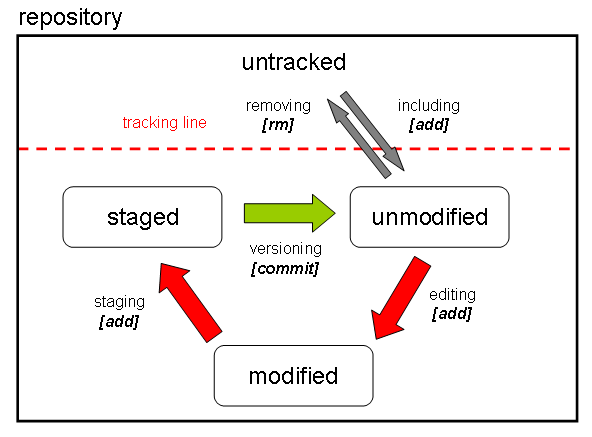

# LCA of a GIT file
###a picture

****



*****

## initialize a new repository

```
git init
```
this command creates a new sub-directory named *.git* inside an existing working directory

remember that at this point nothing in the project is tracked yet

## clone an existing repository

```
git clone git://github.com/some_owner/some_repository.git
```

this command does the following:

- creates a directory named *some_repository*
- initializes a *.git* directory inside it
- pulls down all the data from the existing repository
- checks out a working copy of latest version

what follows is a variation upon the previous command:

```
git clone git://github.com/some_owner/some_repository.git my_repository
```
it does the same things as before **but**  the target directory is now *my_repository*

## check status of files

it is always a good practice to check the status of the files inside the repository

this is simply done by issuing the following command:

```
git status
```
the returned messages give some feedback on what is needed next

## track (add) new files

```
git add a_new_filename
```

## stage (add) modified files

```
git add a_modified_filename
```

## commit the changes

```
git commit -m "here specify a short message about changes"
```

the *commit* records the snapshot set up in the staging process


## add a remote repository from command line

```
git remote add origin git://github.com/some_owner/some_repository.git
```

## push to remotes

```
git push -u origin master
```

## check remote repository

```
git remote -v
```

******

## workflow example 1
### new repository, initialize, add and commit files, add origin, push to remote

```
echo "#my_title" >> README.md
git init
git add README.md
git commit -m "first commit"
git remote add origin git://github.com/some_owner/some_repository.git
git push -u origin master

```
******

## workflow example 2
### clone repository, add and commit files, push back to remote

```
git clone git://github.com/some_owner/some_repository.git
echo "#new_file" >> new_file.md
git add new_file.md
git commit -m "add new_file.md"
git push -u origin master
```
